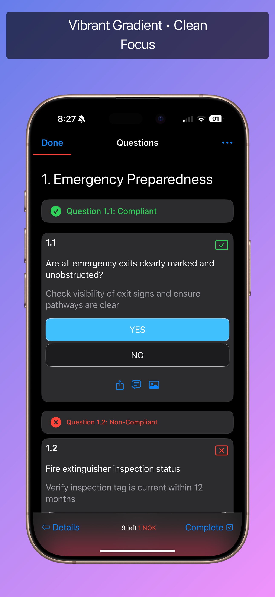
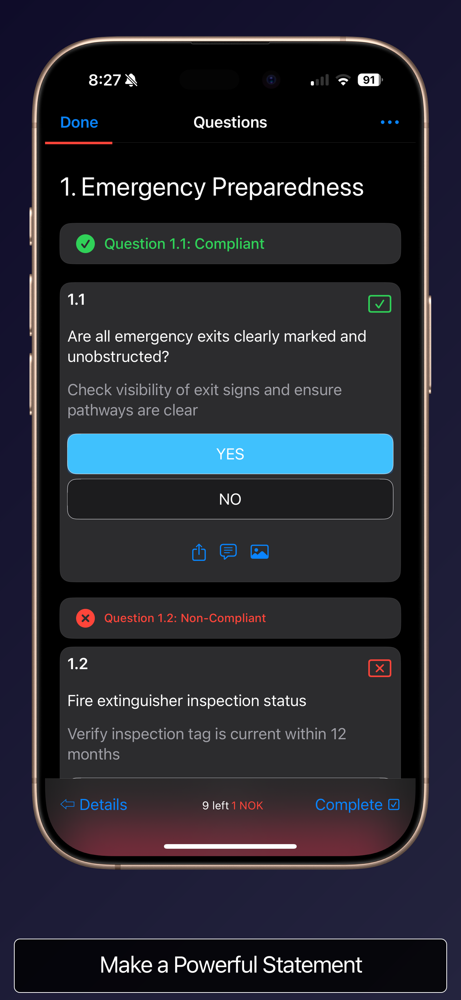

# Appshot Template Gallery

Professional screenshot templates for App Store success. Each template provides a complete visual style including backgrounds, device positioning, caption styling, and device-specific optimizations.

## 🚀 Quick Start

```bash
# Interactive setup
appshot quickstart

# Or apply a specific template
appshot template modern --caption "Your App Name"
```

## 📸 Template Samples

### Modern Template

**Vibrant gradient with floating device**
- 85% device scale, centered
- White captions with semi-transparent background
- Perfect for most apps

```bash
appshot template modern
```

---

### Minimal Template

**Soft pastel background with elegant typography**
- 95% device scale, centered position
- Teal text with white border accent
- Clean and simple design

```bash
appshot template minimal
```

---

### Bold Template

**Dark dramatic gradient with overlay captions**
- 90% device scale, centered
- Large overlay captions with white border
- Great for gaming and entertainment

```bash
appshot template bold
```

---

### Nerdy OSS Template

**Grid-lined midnight theme powered by JetBrains Mono**
- 92% device scale with overlay captions
- Auto-detected `background.png` (hex grid + plasma glow)
- Terminal-inspired palette for developer tools

```bash
appshot template nerdy
```

---

### Elegant Template

**Sophisticated monochrome design**
- 90% device scale (iPhone), 95% base
- Bottom caption positioning
- Professional and refined

```bash
appshot template elegant
```

---

### Showcase Template

**Features custom backgrounds**
- Auto-detects background.png
- 90% device scale, centered
- Glass-morphism caption effect

```bash
appshot template showcase
```

---

### Playful Template

**Bright, fun gradients**
- 95% device scale
- Vibrant colors
- Perfect for games and kids apps

```bash
appshot template playful
```

---

### Corporate Template

**Clean, professional look**
- 85% device scale
- Left-aligned text
- Business and productivity apps

```bash
appshot template corporate
```

## 🎨 Template Comparison


## 🧪 Generate This Gallery Locally

To rebuild all images shown on this page using only assets in this folder:

```bash
# From repo root
npm run samples
```

This will:
- Build the CLI
- Use inputs from `template-samples/screenshots/{iphone|ipad|watch|mac}.png`
- Regenerate device samples in `iphone/`, `ipad/`, `watch/`, and `mac/` (7 presets each)
- Regenerate template cards in `gallery/` (e.g., `gallery/modern-sample.png`)
- Create the combined `gallery/template-gallery.png`

Open `template-samples/index.html` in a browser to view the gallery and device tabs.

### Folder Structure

```
template-samples/
  index.html           # Gallery page (dark theme)
  README.md
  scripts/
    generate-all.sh    # One command to build everything locally
  screenshots/
    iphone.png         # Source inputs used by the generator
    ipad.png
    watch.png
    mac.png
    backgrounds/       # Per-device background.png auto-applied for nerdy preset
      iphone.png
      ipad.png
      watch.png
      mac.png
  iphone/              # 7 generated presets for iPhone
  ipad/                # 7 generated presets for iPad
  watch/               # 7 generated presets for Watch
  mac/                 # 7 generated presets for Mac
  gallery/
    modern-sample.png  # Root card previews (iPhone-based)
    ...                # minimal/bold/elegant/showcase/playful/corporate
    template-gallery.png
```

## 💡 Customization

Templates are starting points that you can customize:

```bash
# 1. Apply a template
appshot template modern

# 2. Fine-tune settings
appshot style --device iphone
appshot fonts --set "Poppins Bold"
appshot caption --device iphone

# 3. Build
appshot build
```

## 📊 Template Specifications

| Template | Base Scale | iPhone Scale | Position | Caption Style |
|----------|------------|--------------|----------|--------------|
| Modern | 85% | 85% | 50 (center) | Above, white on black |
| Minimal | 95% | 95% | 50 (center) | Above, teal with border |
| Bold | 90% | 90% | 45 (high) | Overlay, white on black |
| Nerdy OSS | 90% | 92% | 12 (high) | Overlay, JetBrains Mono |
| Elegant | 95% | 90% | 50 (center) | Below, white on blue |
| Showcase | 90% | 90% | 50 (center) | Above, white on black |
| Playful | 95% | 95% | 60 (low) | Above, white on pink |
| Corporate | 85% | 85% | 50 (center) | Above, dark on white |

### Device-Specific Overrides
All templates include optimized settings for:
- **iPhone**: Custom scale and positioning
- **iPad**: Adjusted for larger screens
- **Mac**: Desktop-optimized layouts
- **Watch**: Smaller scale with below captions

## 📚 Learn More

- [Full Documentation](https://github.com/chrisvanbuskirk/appshot)
- [Template System Guide](../README.md#template-system)
- [Command Reference](../README.md#-command-reference)
